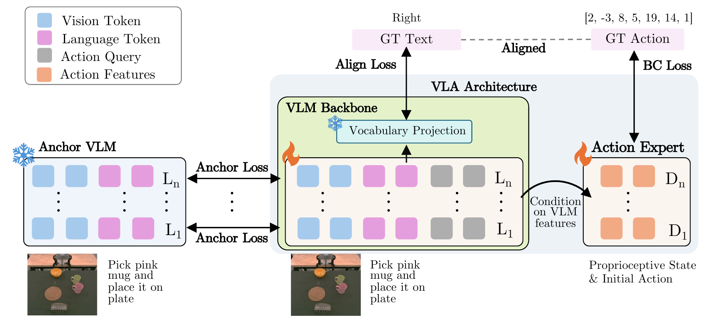
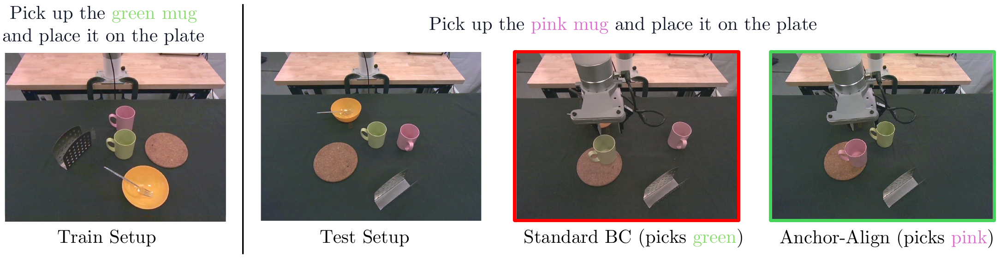
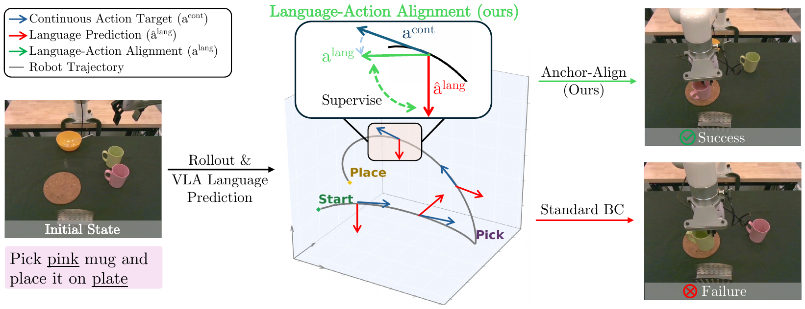
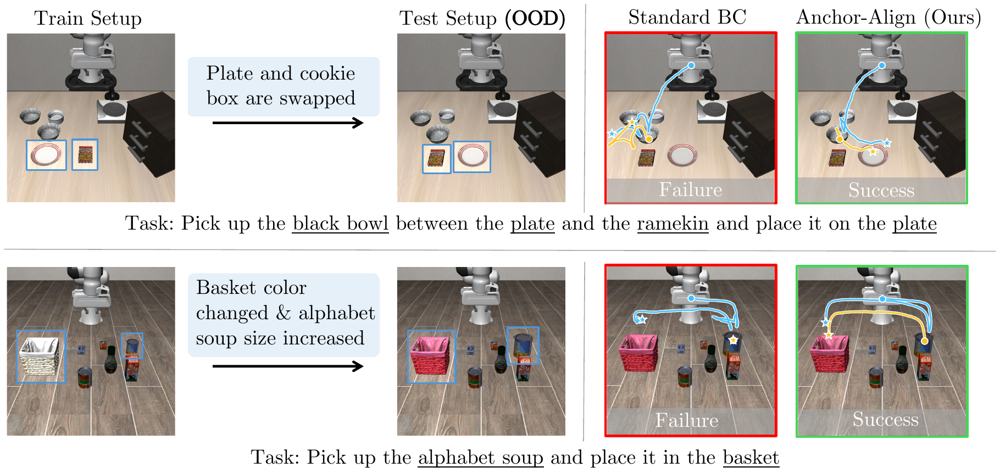
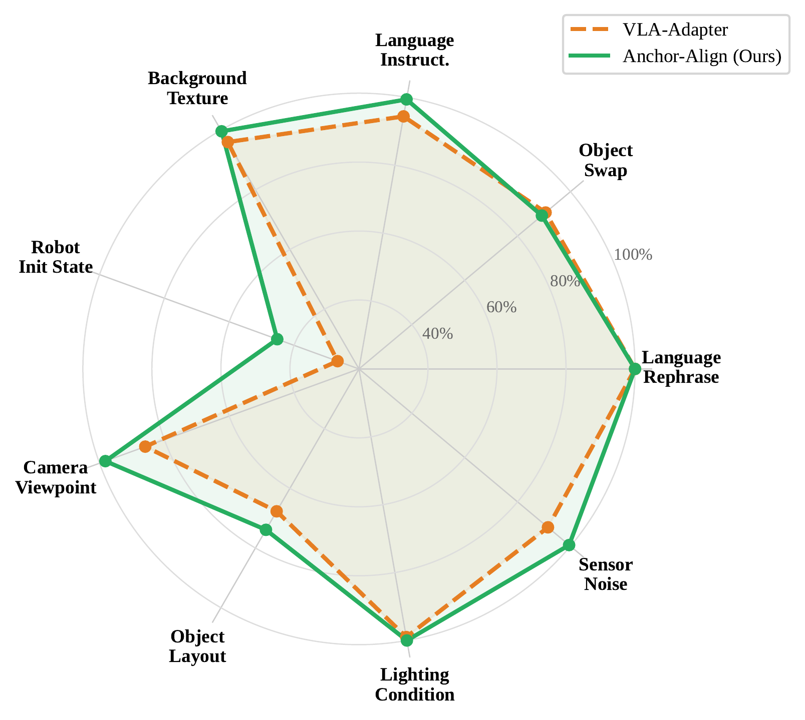
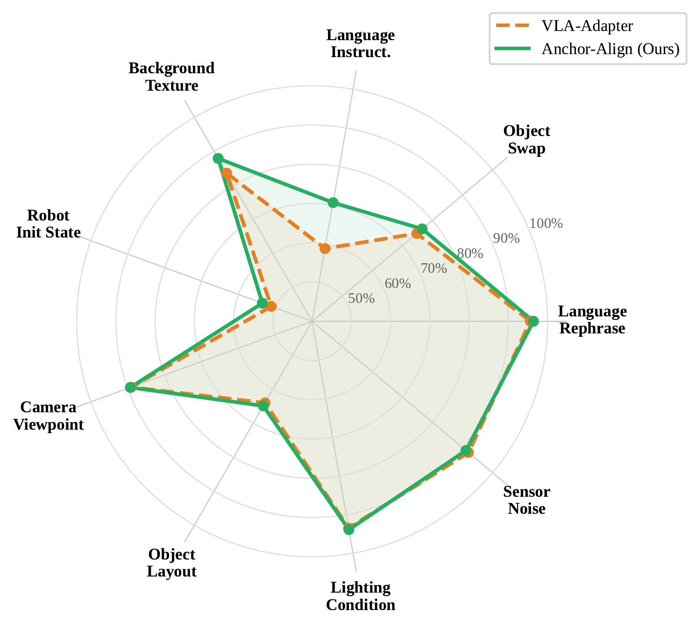
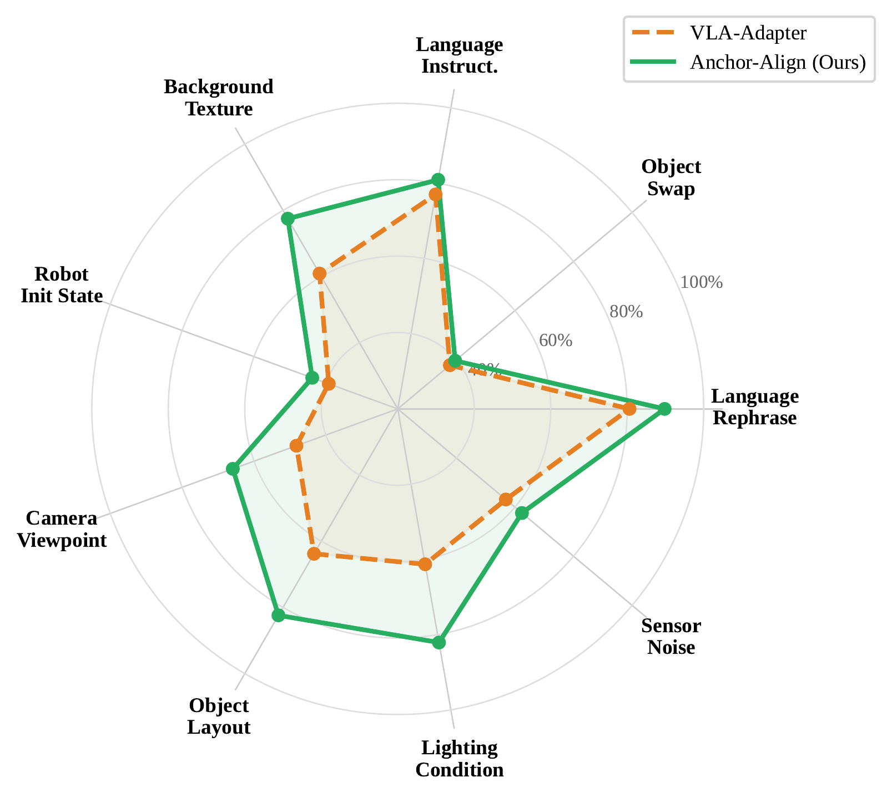
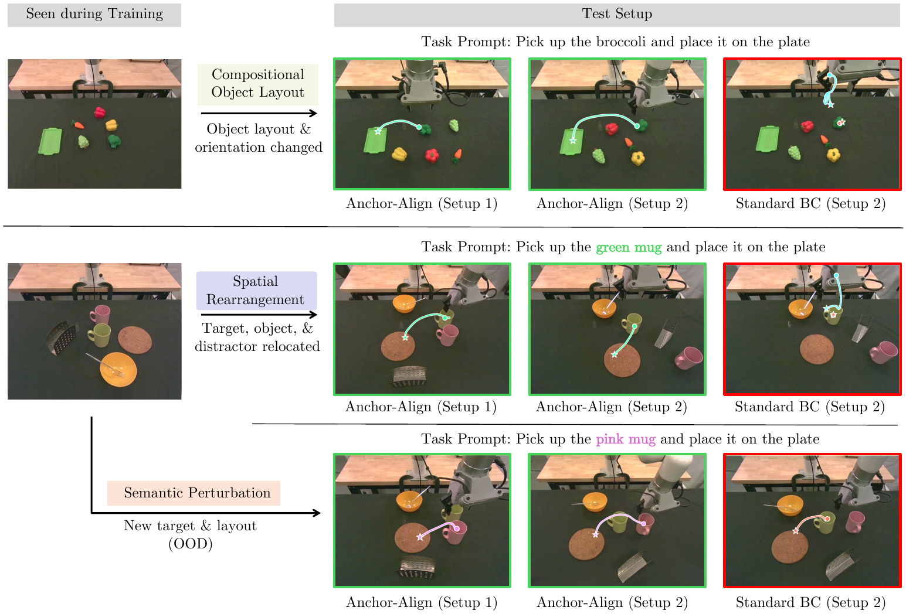
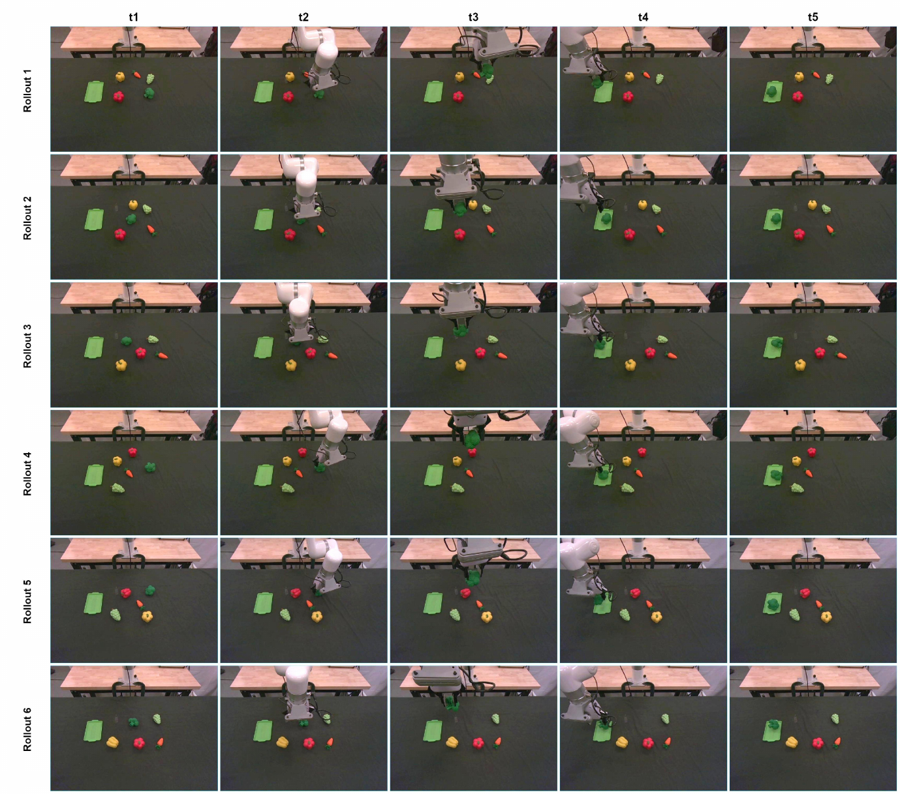
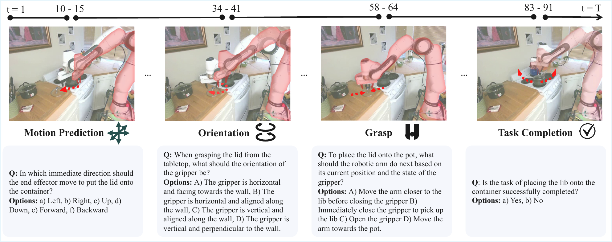

# Generalizable VLA Finetuning via Representation Anchoring and Language-Action Alignment


[**🌐 Project Page**](https://anchoralignvla.github.io/) &nbsp;•&nbsp; [📄 Paper (arXiv)](https://arxiv.org/abs/2607.13429) &nbsp;•&nbsp; [🤗 Checkpoints (HuggingFace)](https://huggingface.co/Dwipz/Anchor-Align) &nbsp;•&nbsp; [🎬 Videos](https://anchoralignvla.github.io/#demo) &nbsp;•&nbsp; [🔬 Reproduce](REPRODUCE.md)

<p align="center">
  
</p>

**TL;DR** — Standard behavior-cloning finetuning of a vision-language model on robot demos silently erases the pretrained VLM's semantics and decouples its language output from its actions. **Anchor-Align** adds two lightweight losses on top of action prediction that (i) *anchor* the trainable VLA to a frozen copy of the pretrained VLM (preserving vision-language reasoning) and (ii) *align* the pre-action hidden state with a discrete motion-direction label derived from the executed motion. The result: **22.6%** on LIBERO-PRO position swap (vs 2.3% for standard BC), **90.3%** LIBERO-Plus average (vs 85.1%), and near-doubled real-world success (**28.3% → 54.2%**) on a UFactory xArm7 setup.

---

## Table of Contents

- [Motivation](#motivation)
- [Method: Anchor-Align](#method-anchor-align)
- [Results](#results)
- [Real-World Experiments](#real-world-experiments)
- [Pretrained Checkpoints](#pretrained-checkpoints)
- [Installation](#installation)
- [Data Preparation](#data-preparation)
- [Training Code](#training-code)
- [Evaluation](#evaluation)
- [Diagnostic Framework](#diagnostic-framework)
- [Repository Layout](#repository-layout)
- [Key Files](#key-files)
- [Acknowledgments](#acknowledgments)
- [Citation](#citation)

---

## Motivation

### Failure mode 1 — the pretrained VLM's semantics are silently erased

Consider a tabletop kitchen scene with a green mug, a pink mug, a plate, and distractors. A policy is trained *only* to "pick up the green mug and place it on the plate" across many spatial arrangements. At test time we prompt "pick up the pink mug." The underlying VLM already understands color — a good finetune should preserve that.

<p align="center">
  
</p>

Standard behavior-cloning ignores the new instruction and picks the green mug anyway. Anchor-Align follows the instruction correctly, because the anchoring loss keeps the VLM's color semantics intact throughout finetuning.

### Failure mode 2 — the model's language and actions disagree on the same observation

<p align="center">
  
</p>

Standard BC supervises only the action head. The language head is free to drift, so the same VLA can report "left" as its next-move direction while its action head simultaneously commands an upward motion on the same observation. Anchor-Align derives a *discrete motion-direction label* from each ground-truth trajectory (six direction words: up, down, left, right, forward, backward) and trains the pre-action hidden state to predict it jointly with the continuous action.

---

## Method: Anchor-Align

The training loss is:

```
L_total  =  L1_action  +  0.1 × L_anchor  +  0.02 × L_align
```

### Vision-Language Anchoring (Anchor loss)

A frozen copy of the pretrained VLM serves as the anchor. At each training step we take the layer-wise hidden states from the student (LoRA-finetuned) VLA and the frozen teacher, then compute per-layer MSE on the **non-action token positions** (BOS + vision patches + text prompt). Action-token positions are masked out so anchoring never fights the action objective.

```
L_anchor = (1 / 2σ²) · mean_over_24_layers[ MSE( student_h, teacher_h ) ]
```

Applied to all 24 transformer layers of Qwen2.5-0.5B, with σ = 1.0. This is the single most important design choice — anchoring the full stack (not just the last layer) is what preserves compositional visual grounding.

### Language-Action Alignment (Align loss)

At the last text token position (immediately before the action tokens), the pre-action hidden state is projected through a small learned head and dotted with the frozen `lm_head`. This yields logits over the Qwen2.5 vocabulary; we take the cross-entropy against a six-way motion-direction label (up, down, left, right, forward, backward) derived from the chunk-averaged action delta.

```
L_align = CrossEntropy( proj(pre_action_hidden) @ frozen_lm_head , direction_word )
```

Direction words are verified to be single-token in the Qwen2.5 vocabulary at startup. Samples with near-zero motion (L2 norm of XYZ delta < 0.15) are ignored so the loss only fires on decisive motions. `align_version=7` uses the pre-action hidden state (after the LLM's self-attention), which preserves the vision patches and therefore does not degrade spatial reasoning.

### Architecture

```
Input Images (2x224x224)
    |
    +-- DINOv2 ViT-L ----> (B, 256, 1024) --+
    |                                         +-- concat on dim=2 --> (B, 256, 2176) per image
    +-- SigLIP SO400M ---> (B, 256, 1152) --+
                                              |
                              concat on dim=1 (2 images) --> (B, 512, 2176)
                                              |
                                      Projector MLP
                                  (2176 -> 8704 -> 896)
                                              |
                                      (B, 512, 896) vision tokens
                                              |
    [BOS] --- concat ----- [vision tokens] ---- [text/action tokens] ---- [EOS]
              |                                        |
              +---------- Qwen2.5-0.5B (24 layers) ----+
                           LoRA rank-64 finetuned
                           output_hidden_states=True
                                              |
                  +--------------------------+
                  |                          |
          Action Head                  Anchor loss  (24 layers)
       (MLPResNet, 24 blocks)         on non-action positions
       --> predicted_actions               |
           (B, 8, 7)               Align loss
                                   pre-action hidden --> CE(direction)
```

---

## Results

Tables below are reproduced from the paper. Evaluation commands for the released checkpoints are in [`REPRODUCE.md`](REPRODUCE.md).

### Standard LIBERO suites

Success rates on the four standard (unperturbed) LIBERO suites. Anchor-Align achieves the highest success rate on every suite, surpassing methods with substantially larger backbones and large-scale robot-action pretraining.

| Method | Spatial | Object | Goal | Long |
|---|---:|---:|---:|---:|
| Diffusion Policy | 78.3 | 92.5 | 68.3 | 50.5 |
| π₀-FAST | 87.0 | 63.0 | 89.0 | 48.0 |
| SmolVLA-0.24B | 87.0 | 93.0 | 88.0 | 63.0 |
| SmolVLA-2.25B | 93.0 | 94.0 | 91.0 | 77.0 |
| OpenVLA-OFT | 94.3 | 95.2 | 91.7 | 86.5 |
| MolmoAct | 87.0 | 95.4 | 87.6 | 77.2 |
| π₀.₅-KI | 96.6 | 97.2 | 94.6 | 85.8 |
| VLA-0 | 93.6 | 96.0 | 95.6 | 87.6 |
| VLA-Adapter [Frozen] | 89.4 | 89.6 | 88.0 | 84.5 |
| VLA-Adapter (standard BC) | 96.0 | 99.8 | 96.0 | 89.0 |
| **Anchor-Align VLA (ours)** | **98.4** | **100.0** | **97.2** | **90.8** |

### Robustness and generalization — LIBERO-PRO and LIBERO-Plus

Success rates under perturbation on the LIBERO-Spatial suite (paper Table 1). **Bold** = best, <u>underline</u> = second best.

<table>
<thead>
<tr><th rowspan="2" align="left">Method</th><th colspan="4">LIBERO-PRO</th><th colspan="8">LIBERO-Plus</th></tr>
<tr><th>Lang. Reph.</th><th>Object Swap</th><th>Pos. Swap</th><th>Mean</th><th>Lang. Instr.</th><th>Bg. Text.</th><th>Robot Init</th><th>Cam. View</th><th>Obj. Layout</th><th>Light Cond.</th><th>Sensor Noise</th><th>Mean</th></tr>
</thead>
<tbody>
<tr><td align="left">Co-training + KI*</td><td>54.0</td><td>77.4</td><td>0.0</td><td>43.8</td><td>48.0</td><td>82.6</td><td>25.7</td><td>64.6</td><td>65.7</td><td>73.3</td><td>49.0</td><td>57.1</td></tr>
<tr><td align="left">MolmoAct</td><td>77.8</td><td>82.4</td><td>0.0</td><td>53.4</td><td>79.5</td><td>84.1</td><td>47.4</td><td>10.1</td><td>76.5</td><td>77.4</td><td>53.4</td><td>60.8</td></tr>
<tr><td align="left">OpenVLA-OFT</td><td>74.4</td><td><u>95.2</u></td><td>0.0</td><td>56.5</td><td>81.5</td><td><u>95.7</u></td><td>40.3</td><td><u>94.7</u></td><td>88.6</td><td><u>95.5</u></td><td>28.2</td><td>74.1</td></tr>
<tr><td align="left">VLA-Adapter [Frozen]</td><td>56.0</td><td>73.4</td><td>0.0</td><td>43.1</td><td>41.5</td><td>70.9</td><td>35.1</td><td>94.4</td><td>62.3</td><td>84.9</td><td>36.2</td><td>59.9</td></tr>
<tr><td align="left">VLA-Adapter (standard BC)</td><td><u>91.1</u></td><td>89.6</td><td><u>2.3</u></td><td><u>61.0</u></td><td><u>85.1</u></td><td>90.7</td><td><u>52.6</u></td><td>92.6</td><td><u>93.2</u></td><td>93.2</td><td><u>89.5</u></td><td><u>85.1</u></td></tr>
<tr><td align="left"><b>Anchor-Align VLA (ours)</b></td><td><b>97.0</b></td><td><b>96.2</b></td><td><b>22.6</b></td><td><b>71.9</b></td><td><b>87.2</b></td><td><b>99.6</b></td><td><b>59.1</b></td><td><b>96.3</b></td><td><b>97.4</b></td><td><b>99.0</b></td><td><b>96.9</b></td><td><b>90.3</b></td></tr>
</tbody>
</table>

\*Our implementation of knowledge insulation adapted to VLA-Adapter. Position swap is the hardest axis: MolmoAct and OpenVLA-OFT score 0%, standard BC reaches 2.3%, while Anchor-Align reaches 22.6%.

### Qualitative — generalization to semantic perturbations

<p align="center">
  
</p>

Same task, different phrasing / different object identity / shuffled positions. Anchor-Align retains the VLM's semantic understanding of what the instruction refers to, while the baseline latches onto memorized appearance shortcuts.

### Per-suite robustness — Object, Goal, and Long

The same gains carry over to the remaining three LIBERO suites. Each radar plot compares Anchor-Align (orange) against the standard BC VLA-Adapter baseline (gray) across nine evaluation axes: two from LIBERO-PRO (Language Rephrase, Object Swap) and seven from LIBERO-Plus.

<p align="center">
  
  
  
</p>

Largest gains: Robot Init State +18.6 on Object; Language Instruction +11.9 on Goal; Lighting Condition +20.8, Object Layout +18.6, and Camera Viewpoint +17.7 on Long.

### Long-horizon generalization — CALVIN ABC→D

Each rollout chains five language instructions; k/5 is the fraction of rollouts completing the first k, and Len is the average number of consecutively completed tasks.

| Method | 1/5 | 2/5 | 3/5 | 4/5 | 5/5 | Len |
|---|---:|---:|---:|---:|---:|---:|
| UniVLA | 95.5 | 85.8 | 75.4 | 66.9 | 56.5 | 3.8 |
| OpenVLA-OFT | 96.3 | 89.1 | 82.4 | 75.8 | 66.5 | 4.1 |
| OpenHelix | 97.1 | 91.4 | 82.8 | 72.6 | 64.1 | 4.1 |
| VLA-Adapter (standard BC) | <u>98.3</u> | <u>94.0</u> | <u>87.5</u> | <u>80.0</u> | <u>73.1</u> | <u>4.3</u> |
| **Anchor-Align VLA (ours)** | **99.1** | **95.8** | **90.6** | **84.7** | **77.9** | **4.5** |

### Five-seed results

The five-seed success rates reported in the paper are shown below as mean ± standard deviation.

| Method | Spatial (Std) | Lang. Reph. | Object Swap | Pos. Swap | Plus |
|---|---:|---:|---:|---:|---:|
| VLA-Adapter (standard BC) | 93.3 ± 0.3 | 91.1 ± 0.4 | 90.1 ± 0.5 | 2.6 ± 0.7 | 85.3 ± 0.3 |
| **Anchor-Align VLA (ours)** | **97.9 ± 0.3** | **97.1 ± 0.5** | **96.1 ± 0.4** | **23.5 ± 0.2** | **90.5 ± 0.6** |

---

## Real-World Experiments

We evaluate on a **UFactory xArm7** across four held-out perturbation regimes: spatial rearrangement, cluttered scene, compositional object-layout, and semantic perturbation (pink-mug OOD).

<p align="center">
  
</p>

Each row is a held-out perturbation regime; **green borders = Anchor-Align succeeds**, **red borders = baseline fails on the same setup**. The layout seen during training (left) differs from the layout at test (right). Anchor-Align generalizes across all three regimes on both VLA backbones we tested; the baseline fails on every held-out configuration.

### Real-world rollouts (appendix): broccoli pick-and-place

<p align="center">
  
</p>

Six evenly-spaced keyframes per row. The broccoli's position **and** the surrounding distractors are simultaneously swapped across rollouts — each episode is a unique scene configuration. All six succeed.

### Videos

See many more demonstrations on the **[project page](https://anchoralignvla.github.io/)**. 

---

## Pretrained Checkpoints

The four release checkpoints live on HuggingFace at [**`Dwipz/Anchor-Align`**](https://huggingface.co/Dwipz/Anchor-Align); this GitHub repo contains the inference and evaluation code for them. The two repos are paired: **HF hosts the weights, GitHub hosts the code.**

Each subfolder is a self-contained inference bundle: merged base VLM (`model.safetensors`) + LoRA adapter (`lora_adapter/adapter_model.safetensors`) + action head (`action_head--<step>_checkpoint.pt`) + alignment projector (`align_dir_proj--<step>_checkpoint.pt`) + proprio projector (`proprio_projector--<step>_checkpoint.pt`) + tokenizer + config. See each subfolder's `MODEL_CARD.md` for full per-metric breakdowns.

### Download a checkpoint

```python
from huggingface_hub import snapshot_download

# Grab a single checkpoint into a local directory
local_dir = snapshot_download(
    repo_id="Dwipz/Anchor-Align",
    allow_patterns=["config.json", "libero-spatial/*"],   # or libero-object/*, libero-goal/*, libero-long/*
    local_dir="./checkpoints",
)
print("Downloaded to:", local_dir)
```

### Run inference on the downloaded checkpoint

Point the corresponding eval script (from this repo) at the local path:

```bash
# LIBERO Standard evaluation (uses the Spatial checkpoint above)
CUDA_VISIBLE_DEVICES=0 python experiments/robot/libero/run_libero_eval.py \
  --pretrained_checkpoint ./checkpoints/libero-spatial \
  --task_suite_name libero_spatial \
  --use_proprio True --num_images_in_input 2 --use_pro_version True

# LIBERO-PRO perturbation evaluation
CUDA_VISIBLE_DEVICES=0 python experiments/robot/libero_pro/run_libero_pro_eval.py \
  --pretrained_checkpoint ./checkpoints/libero-spatial \
  --base_suite_name libero_spatial \
  --perturbation_type lan  \
  --use_proprio True --num_images_in_input 2 --use_pro_version True
```

The inference flags shown here (`--use_proprio True --num_images_in_input 2 --use_pro_version True --use_l1_regression True --center_crop True --num_open_loop_steps 8`) are the same flags used in the paper — see the "Evaluation" section below for LIBERO-Plus and batched variants.

---

## Installation

### Environment Setup

```bash
conda create -n anchor-align python=3.10.16 -y
conda activate anchor-align
```

### Install Dependencies

```bash
# Install PyTorch (use a command specific to your machine: https://pytorch.org/get-started/locally/)
pip install torch==2.2.0 torchvision==0.17.0 torchaudio==2.2.0

# Clone and install
git clone https://github.com/dwipddalal/Anchor-Align.git
cd Anchor-Align
pip install -e .
```

---

## Data Preparation

### LIBERO benchmark variants

We report numbers on **three** LIBERO benchmarks: the standard suite ([`LIBERO`](https://github.com/Lifelong-Robot-Learning/LIBERO)), the paraphrase / swap / object perturbation suite ([`LIBERO-PRO`](https://github.com/Zxy-MLlab/LIBERO-PRO)), and the 7-category robustness suite ([`LIBERO-Plus`](https://github.com/sylvestf/LIBERO-plus)). **All three install as the `libero` Python package, so they are mutually exclusive in a single environment** — install whichever variant matches the eval you want to run, or use separate conda envs.

The helper script installs any single variant or clones all three side-by-side:

```bash
# Standard LIBERO only (LIBERO Standard eval)
bash setup/install_libero_variants.sh libero --dest ../libero-variants

# LIBERO-PRO (Standard + PRO evals)
bash setup/install_libero_variants.sh libero-pro --dest ../libero-variants
export LIBERO_PRO_ROOT="../libero-variants/LIBERO-PRO"

# LIBERO-Plus (Standard + Plus evals)
bash setup/install_libero_variants.sh libero-plus --dest ../libero-variants
export LIBERO_PLUS_ROOT="../libero-variants/LIBERO-plus"

# All three side-by-side (switch between them with `pip install -e .`)
bash setup/install_libero_variants.sh all --dest ../libero-variants
```

Then install the extra requirements this repo needs on top:

```bash
pip install -r experiments/robot/libero/libero_requirements.txt
```

The Plus eval script (`run_libero_plus_eval*.py`) reads `LIBERO_PLUS_ROOT` to find the perturbation BDDL / init-state files, and the PRO SLURM templates add `LIBERO_PRO_ROOT` to `PYTHONPATH`. See [`REPRODUCE.md`](REPRODUCE.md) for the full per-benchmark reproduction recipe.

### LIBERO RLDS datasets (only needed for the alignment diagnostic, not inference)

None of the benchmark evals need these. They are only required by the alignment diagnostic (`experiments/robot/libero/run_alignment_test.py`), which samples frames from the RLDS pipeline. Download the [modified LIBERO RLDS datasets](https://huggingface.co/datasets/openvla/modified_libero_rlds) (~10 GB total):

```bash
git clone git@hf.co:datasets/openvla/modified_libero_rlds
```

> **Note**: Rename the downloaded directory to remove the `modified_` prefix so paths match the expected structure below.

> **Important — `--remap-axes` when running the diagnostic.** The `libero-spatial`, `libero-object`, and `libero-goal` checkpoints use a transposed X/Y direction-label convention, so you **must** pass `--remap-axes` to reproduce their alignment numbers; the `libero-long` checkpoint uses the LIBERO-frame convention, so run it **without** the flag. (`--dataset` selects the RLDS frames to probe on and accepts `libero_spatial_no_noops` or `libero_object_no_noops`; the remap depends on the *checkpoint*, not the dataset. Use `--phase full` for a real run.) See the header comment in `run_alignment_test.py` for the per-checkpoint rule.

If you encounter `AttributeError: 'NoneType' object has no attribute 'eglQueryString'`:

```bash
sudo apt-get update
sudo apt-get install libgl1-mesa-dev libegl1-mesa-dev libgles2-mesa-dev libglew-dev
```

### Directory Structure

```
.
├── data
│   └── libero
│       ├── libero_spatial_no_noops/1.0.0/
│       ├── libero_object_no_noops/1.0.0/
│       ├── libero_goal_no_noops/1.0.0/
│       └── libero_10_no_noops/1.0.0/
└── pretrained_models
    ├── configs/
    └── prism-qwen25-extra-dinosiglip-224px-0_5b/
```

### VLM backbone (optional, not needed for inference)

The four HuggingFace checkpoints already ship with a merged `model.safetensors` that includes the backbone weights, so **you do NOT need to download the backbone separately to run inference / eval**. It's only needed if you want to re-apply the released LoRA adapters to the base VLM yourself (`vla-scripts/merge_lora_weights_and_save.py`).

If you do need it, download the Prismatic VLM (Qwen2.5-0.5B + DINOv2 + SigLIP) into `pretrained_models/`:

```bash
# Requires huggingface_hub CLI (installed by `pip install -e .` above)
huggingface-cli download Stanford-ILIAD/prism-qwen25-extra-dinosiglip-224px-0_5b \
  --local-dir pretrained_models/prism-qwen25-extra-dinosiglip-224px-0_5b \
  --local-dir-use-symlinks False

# Or with Python:
python -c "
from huggingface_hub import snapshot_download
snapshot_download(
    repo_id='Stanford-ILIAD/prism-qwen25-extra-dinosiglip-224px-0_5b',
    local_dir='pretrained_models/prism-qwen25-extra-dinosiglip-224px-0_5b',
    local_dir_use_symlinks=False,
)
"
```

The backbone is ~2.5 GB. `pretrained_models/configs/` is already in the repo and doesn't need to be downloaded.

---

## Training Code

Everything needed to run and evaluate the released checkpoints ships in this repo, and the full training configuration of each checkpoint is documented in its model card on [HuggingFace](https://huggingface.co/Dwipz/Anchor-Align).

The standalone [real-world xArm7 mug training bundle](real_world_training/README.md) contains the StarVLA source snapshot, dataset registry, portable configs, preflight checks, and launch scripts for the green-mug pickup task. Datasets, base-model weights, EEF caches, and checkpoints remain external artifacts.

---

## Evaluation

### LIBERO Standard

```bash
CUDA_VISIBLE_DEVICES=0 python experiments/robot/libero/run_libero_eval.py \
  --use_proprio True \
  --num_images_in_input 2 \
  --pretrained_checkpoint ./checkpoints/libero-spatial \
  --task_suite_name libero_spatial \
  --use_pro_version True
```

Swap `libero_spatial` for `libero_object`, `libero_goal`, or `libero_10`, and point `--pretrained_checkpoint` at the matching checkpoint.

### LIBERO-PRO (perturbation robustness)

```bash
# Language perturbation (paraphrased instructions)
CUDA_VISIBLE_DEVICES=0 python experiments/robot/libero_pro/run_libero_pro_eval.py \
  --use_proprio True \
  --num_images_in_input 2 \
  --pretrained_checkpoint ./checkpoints/libero-spatial \
  --base_suite_name libero_spatial \
  --perturbation_type lan \
  --use_pro_version True

# Object perturbation      →  --perturbation_type object
# Position-swap perturbation →  --perturbation_type swap
```

### LIBERO-Plus (7-category perturbation suite, batched)

```bash
CUDA_VISIBLE_DEVICES=0 python experiments/robot/libero_plus/run_libero_plus_eval_batched.py \
  --use_proprio True \
  --num_images_in_input 2 \
  --pretrained_checkpoint ./checkpoints/libero-spatial \
  --base_suite_name libero_spatial \
  --batch_size 48 \
  --use_pro_version True
```

All release evals in this repo use the same inference flags: `use_proprio=True`, `num_images_in_input=2`, `use_film=False`, `use_l1_regression=True`, `center_crop=True`, `num_open_loop_steps=8`. Baseline and Anchor-Align are compared with identical flags — the only difference is the checkpoint being evaluated.

---

## Diagnostic Framework

To measure *whether* a VLA's language head agrees with its action head, we introduce a four-axis diagnostic pipeline that operates on any robot trajectory without additional human annotation.

<p align="center">
  
</p>

Each episode is segmented into four short windows corresponding to distinct behaviors — **Motion Direction**, **Orientation**, **Grasp**, and **Task Completion**. Ground-truth labels for each window are derived programmatically from the demonstration (e.g. the sign of the XYZ delta gives the direction label; the gripper state gives the grasp label). Templated questions are then posed to the VLA on the same observations, and its language accuracy on each axis is compared against its action success on that same axis. This gives us a per-axis measure of language-action alignment. Prior co-trained VLAs are poorly aligned on every axis; Anchor-Align raises alignment from 16.8% to 78.4% on LIBERO-PRO rollouts and turns the alignment-success correlation strongly positive (+0.51).

---

## Repository Layout

| Path | What it is |
|---|---|
| `vla-scripts/` | CALVIN evaluation, LoRA-merge utility, deployment server |
| `real_world_training/` | Self-contained StarVLA training bundle for the real-world xArm7 green-mug task |
| `prismatic/` | Model and data library (VLM backbone, action heads, RLDS pipeline) |
| `experiments/robot/` | LIBERO / LIBERO-PRO / LIBERO-Plus evaluation scripts |
| `pretrained_models/` | Backbone configs and tokenizer files (weights are downloaded separately) |
| `scripts/` | Language-head diagnostic utility |
| `slurm/` | SLURM templates for CALVIN evaluation |
| `assets/` | Figures used in this README |

---

## Key Files

| File | Description |
|---|---|
| `prismatic/models/action_heads.py` | `L1RegressionActionHead` with MLPResNet (Pro version) |
| `prismatic/training/train_utils.py` | Action-token mask utilities (imported by the model code) |
| `prismatic/vla/datasets/datasets.py` | RLDS data pipeline and batch transforms |
| `prismatic/vla/constants.py` | Robot constants (action dims, token counts) |
| `experiments/robot/libero/run_libero_eval.py` | LIBERO standard evaluation |
| `experiments/robot/libero/run_libero_eval_batched.py` | Batched LIBERO eval (paralleled envs) |
| `experiments/robot/libero_pro/run_libero_pro_eval.py` | LIBERO-PRO (perturbation) evaluation |
| `experiments/robot/libero_plus/run_libero_plus_eval_batched.py` | LIBERO-Plus batched eval |
| `experiments/robot/robot_utils.py` | Evaluation utilities and seeding |
| `slurm/` | SLURM templates for CALVIN evaluation |

---

## Acknowledgments

This codebase builds on [VLA-Adapter](https://github.com/OpenHelix-Team/VLA-Adapter) (Wang et al., 2025), which provides the base model architecture (Prismatic VLM + action head) and training infrastructure. We also thank [OpenVLA-OFT](https://github.com/moojink/openvla-oft), [MiniVLA](https://github.com/Stanford-ILIAD/openvla-mini), and [starVLA](https://github.com/starVLA/starVLA) for their open-source contributions.

---

## Citation

```bibtex
@article{dalal2026anchoralign,
  title   = {Generalizable VLA Finetuning via Representation Anchoring and Language-Action Alignment},
  author  = {Dalal, Dwip and Patel, Shivansh and Jain, Chahit and Kim, Jeonghwan and Mishra, Utkarsh and Baratian, Alex and Ha, Hyeonjeong and Ji, Heng and Lazebnik, Svetlana and Jain, Unnat},
  journal = {arXiv preprint arXiv:2607.13429},
  year    = {2026}
}
```
